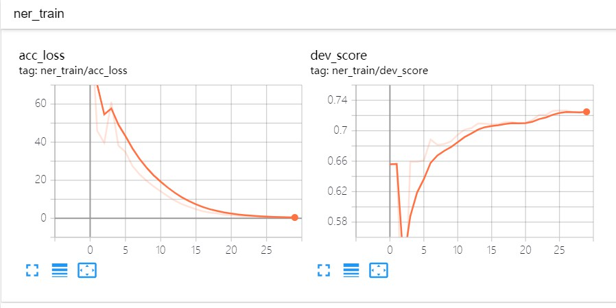
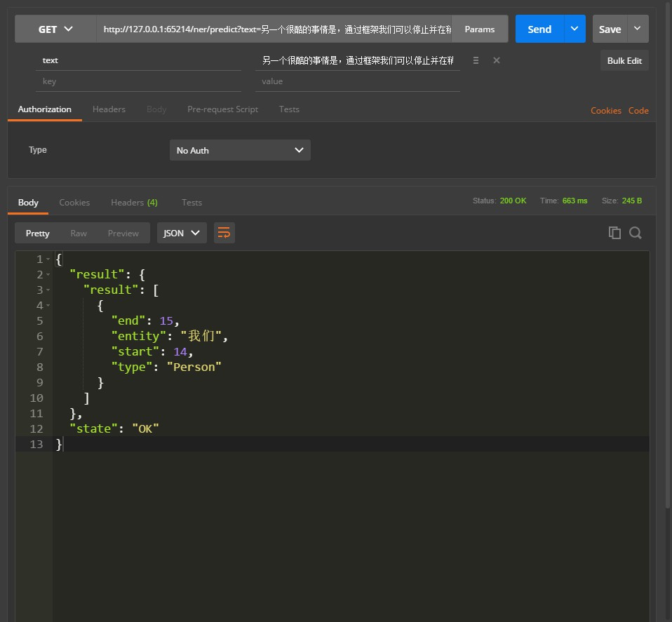

# 命名实体识别（ner）
## 1.训练数据

BIO

训练数据示例如下：

```
清 B_Time
明 I_Time
是 O
人 B_Person
们 I_Person
祭 O
扫 O
先 B_Person
人 I_Person
， O
怀 O
念 O
追 O
思 O
的 O
日 B_Time
子 I_Time
。 O

正 O
如 O
宋 B_Time
代 I_Time
诗 B_Person
人 I_Person
```

## 2.使用示例
### 1.训练

```
from lightnlp.sl import NER

# 创建NER对象
ner_model = NER()

train_path = '/home/lightsmile/NLP/corpus/ner/train.sample.txt'
dev_path = '/home/lightsmile/NLP/corpus/ner/test.sample.txt'
vec_path = '/home/lightsmile/NLP/embedding/char/token_vec_300.bin'

# 只需指定训练数据路径和TensorBoard日志文件路径，预训练字向量可选，开发集路径可选，模型保存路径可选（模型保存路径默认为`xx_saves`，其中xx为模型简称，如ner）。
ner_model.train(train_path, vectors_path=vec_path, dev_path=dev_path, save_path='./ner_saves', log_dir='E:/Test/tensorboard/')
```

### 2.测试

```
# 加载模型，默认当前目录下的`ner_saves`目录
ner_model.load('./ner_saves')
# 对train_path下的测试集进行读取测试
ner_model.test(train_path)
```

### 3.预测

```
from pprint import pprint

pprint(ner_model.predict('另一个很酷的事情是，通过框架我们可以停止并在稍后恢复训练。'))
```

预测结果：

```
[{'end': 15, 'entity': '我们', 'start': 14, 'type': 'Person'}]
```

### 4.查看训练效果

命令行中执行以下命令，其中`E:\Test\tensorBoard`修改为模型训练时日志存储路径，port端口指定可选：
```bash
tensorboard --logdir=E:\Test\tensorBoard --port=2019
```

可以看到类似如下效果：



### 5.部署服务

```python
ner_model.deploy(host="localhost", port=2020, debug=False)
```
其中所有参数都可选，`host`参数默认为`localhost`，`port`端口将由程序自动向系统申请空闲端口，默认不开启`debug`模式。

可以使用Postman或者编写程序进行调用测试，如下图：

